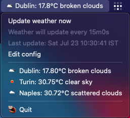

# wea

Monitor weather in your system tray



Build with
```
go build
```

On systems without the new `ayatana` appindicator (e.g. Fedora), use
```
go build -tags=legacy_appindicator
```

Create a configfile at `~/.config/bgchanger/config.json` with content similar to
the following:
```
{
    "locations": ["dublin", "san francisco"],
    "openweathermap_api_key": "your api key",
    "googlemaps_api_key": "your api key",
    "interval": "15m",
    "language": "en",
    "units": "metric",
    "show_graph": true,
    "debug": false,
    "editor": "gedit",
    "editor_args": []
}
```

Where:
* `locations` is a list of strings, each representing a location that will be geocoded by the Google Maps API
* `openweathermap_api_key` is an OpenWeatherMap API key. You need an account on openweathermap.com to create one
* `googlemaps_api_key` is a Google Maps API key. You need a Google Cloud account to create the API key. You need the Geocoding API to be enabled
* `interval` is the time interval between weather updates, according to Go's [`time.ParseDuration` format](https://pkg.go.dev/time#ParseDuration)
* `language` is a two-letter language code string, e.g. "EN" or "IT". The string is 'ase-insensitive
* `units` is one of "metric", "imperial", or "standard"
* `show_graph` (optional, default: false) shows a temperature graph for the current location if set to `true`, or a weather icon if `false`
* `debug` (optional, default: false) prints debug messages on the terminal
* `editor` (optional: default depends on OS) is the program name for the editor used to modify the configuration. If it's not an absolute path, the program must be in the default path
* `editor_args` (optional, default is empty) is a set of optional arguments to pass to the editor. For example you may want to use `["-a", "TextEdit"]` on macOS

## Create DMG for macOS

```
./scripts/build-macos.sh
```

## Weather update after resume

(linux-only, systemd-only)

If you want the weather and location to update after resuming, you can copy
[`scripts/wea-resume.sh`](scripts/wea-resume.sh) under your
`systemd-suspend.service` scripts directory (typically
`/usr/lib/systemd/systemd-sleep`).
The scripts simply sends a `SIGUSR1` to the `wea` program, which will initiate
a weather update.
